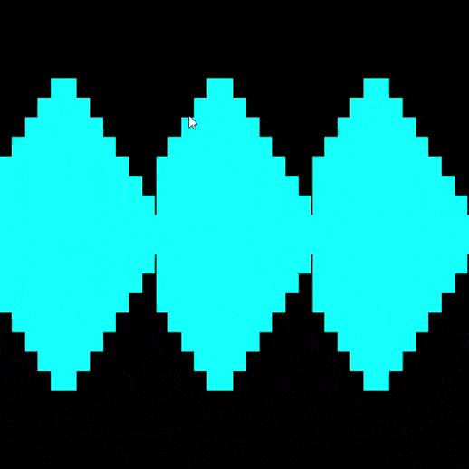

# P9. Shaders

### Autor: Jonay Suárez Ramírez

## Descripción

En este proyecto se ha desarrollado un shader generativo de glsl que recrea una serie de barras o "escalera" en torno al ratón.

El planteamiento original era que la barras fuesen de un tamaño en base de una entrada de sonido, una canción o similar pero por desconocimiento, la posibilidad de meter sonido no fue posible.

En su lugar para dotar de algo de interacción al shader, escalera se mueve entorno al ratón en X, la amplitud de la escalera según la distancia del ratón al centro y un movimiento de contracción cíclico segun el tiempo.

Se utilizan las uniform `u_resolution`, `u_mouse` y `u_time` para ello.

## Controles
- El ratón tanto en X como en Y.

## Referencias y Herramientas

1. The Book of Shaders https://thebookofshaders.com/.

2. Guión de prácticas de CIU.

3. Documentación online de glsl.

4. Crear GIF animado: https://www.online-convert.com/es.

## Resultado

